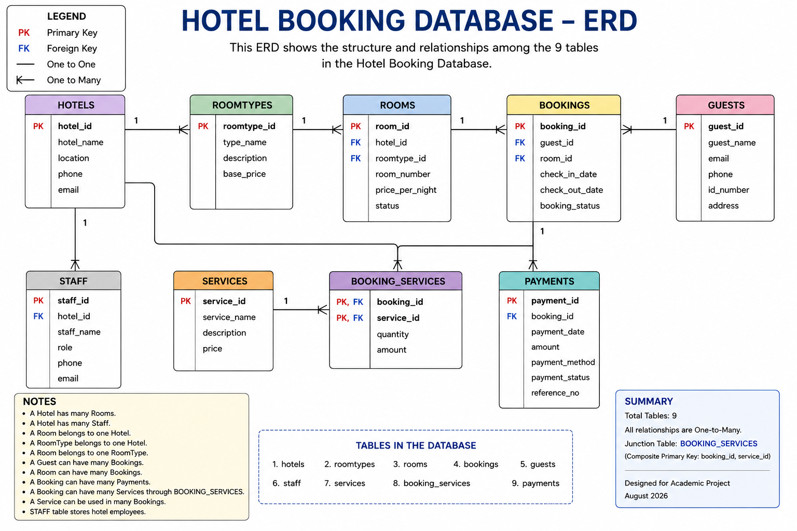

# Hotel Booking Database

## Team

| Name | GitHub username | Role on this project |
|---|---|---|
| Praise | @Og​​oto99 | GitHub, integration, testing & hotels |
| Angelah | @Angelah-M | Rooms & room types |
| Jane | @Jane-star98 | Guests |
| Josphat Kimutai | @jos​​phat-kimutai | Bookings |
| Nyutu | @michaelnjogu822-ui | Payments |
| Michael | @MichaelWahinya | Services & booking services |
| Nancy | @Nancy-mm | Staff |
| Vincent | @vincentmutuma18-creator | DQL & advanced queries |
| Whist-Estella | @whist-estella | README, ERD & views |

## Domain

This database models a hotel booking and management system. It manages hotels, room types, rooms, guests, bookings, payments, staff, and additional hotel services. The database helps hotel management keep track of reservations, guest information, hotel staff, services, and revenue-related information.

## Entity-Relationship Diagram



The database connects hotels to their rooms and staff. Room types are used to categorize rooms, while guests make bookings for rooms. Bookings can have payments and can use multiple hotel services through the `booking_services` junction table.

## Schema Summary

| Table | Purpose | Key relationships |
|---|---|---|
| `hotels` | Stores information about hotels. | Referenced by `rooms` and `staff`. |
| `room_types` | Stores categories and types of hotel rooms. | Connected to `rooms`. |
| `rooms` | Stores individual hotel rooms and their details. | References `hotels` and `room_types`; referenced by `bookings`. |
| `guests` | Stores information about hotel guests. | Referenced by `bookings`. |
| `bookings` | Stores guest room reservations, dates and booking status. | References `guests` and `rooms`; referenced by `payments` and `booking_services`. |
| `payments` | Stores payments made for bookings. | References `bookings`. |
| `services` | Stores additional services offered to guests. | Connected to `bookings` through `booking_services`. |
| `booking_services` | Junction table connecting bookings and services. | References `bookings` and `services`; implements the many-to-many relationship. |
| `staff` | Stores information about hotel employees. | References `hotels`. |

## Repository Structure

```text
Hotel-booking-DB/
├── README.md
├── ddl/
│   └── 01_schema.sql        -- table definitions, keys, constraints
├── dml/
│   └── 01_seed_data.sql     -- sample data
├── dql/
│   └── 01_queries.sql       -- analytical queries + views
└── docs/
    └── erd.png              -- entity-relationship diagram

## How to Run This Project
1. Create a fresh database
CREATE DATABASE hotel_booking_test;
USE hotel_booking_test;
2. Run the schema script
mysql -u root -p hotel_booking_test < ddl/01_schema.sql
3. Load the sample data
mysql -u root -p hotel_booking_test < dml/01_seed_data.sql
4. Run the queries
mysql -u root -p hotel_booking_test < dql/01_queries.sql

The scripts must be run in this order:

DDL → DML → DQL

DDL creates the database tables, DML inserts the sample data, and DQL retrieves and analyzes the data.

##  Featured Queries
1. Which hotels have the highest ratings?
SELECT
    hotel_name,
    location,
    rating
FROM hotels
ORDER BY rating DESC;

Why it matters: This helps management compare hotels based on their ratings.

2. How many hotels are available in each location?
SELECT
    location,
    COUNT(*) AS total_hotels
FROM hotels
GROUP BY location
ORDER BY total_hotels DESC;

Why it matters: This helps management understand the distribution of hotels across different locations.

3. Which guests have made the most bookings?
SELECT
    g.first_name,
    g.last_name,
    COUNT(b.booking_id) AS total_bookings
FROM guests g
JOIN bookings b
    ON g.guest_id = b.guest_id
GROUP BY g.guest_id, g.first_name, g.last_name
ORDER BY total_bookings DESC;

Why it matters: This helps identify frequent guests and understand customer booking activity.

4. Which hotels generate the most revenue?
SELECT
    h.hotel_name,
    SUM(p.amount) AS total_revenue
FROM hotels h
JOIN rooms r
    ON h.hotel_id = r.hotel_id
JOIN bookings b
    ON r.room_id = b.room_id
JOIN payments p
    ON b.booking_id = p.booking_id
GROUP BY h.hotel_id, h.hotel_name
ORDER BY total_revenue DESC;

Why it matters: This helps management compare revenue generated by different hotels.

## Views
View name |	What it shows |	Why we made it a view
booking_summary |	Shows booking information including guest, room, dates and booking status. |	Makes frequently needed booking information easier to access.
hotel_revenue |	Shows revenue information for hotels based on bookings and payments. |	Helps management quickly review and compare hotel revenue.


## Assumptions & Design Decisions
Each guest can make multiple bookings, but each booking belongs to one guest.
Each booking is associated with one room.
A room can have multiple bookings over time.
Each hotel can have multiple rooms and staff members.
Room types are separated from individual rooms to avoid repeating room-type information.
Payments are linked to bookings so payment information can be tracked separately.
A booking can use multiple services.
A service can be used by multiple bookings.
The booking_services table implements the many-to-many relationship between bookings and services.
Hotel ratings are stored on a scale from 0.0 to 5.0.
Booking dates require the checkout date to be later than the check-in date.
The database uses MySQL.
DDL, DML and DQL are stored in separate scripts.